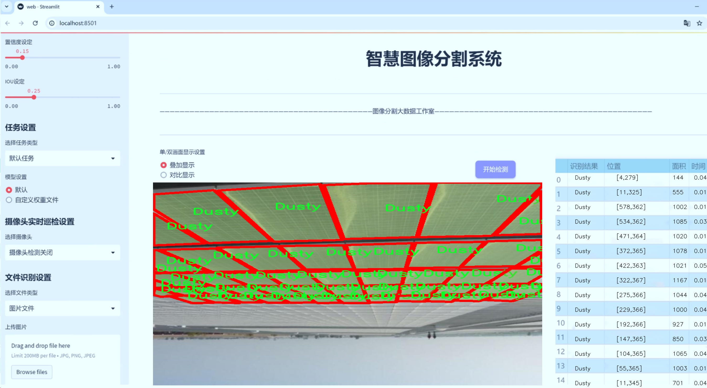

# 太阳能面板缺陷分割系统： yolov8-seg-C2f-REPVGGOREPA

### 1.研究背景与意义

[参考博客](https://gitee.com/YOLOv8_YOLOv11_Segmentation_Studio/projects)

[博客来源](https://kdocs.cn/l/cszuIiCKVNis)

研究背景与意义

随着全球对可再生能源的重视，太阳能作为一种清洁、可再生的能源形式，得到了广泛的应用和推广。太阳能面板的使用不仅有助于减少温室气体排放，还能有效降低能源成本。然而，太阳能面板在长期使用过程中，常常会受到各种环境因素的影响，导致出现不同类型的缺陷，如污垢、鸟粪、划痕和其他物理损伤。这些缺陷不仅影响太阳能面板的发电效率，还可能导致设备的早期故障，从而增加维护成本。因此，及时、准确地检测和分割太阳能面板上的缺陷，对于提高其使用效率和延长其使用寿命具有重要的现实意义。

在这一背景下，计算机视觉技术的迅速发展为太阳能面板缺陷检测提供了新的解决方案。特别是基于深度学习的目标检测和分割技术，已经在多个领域取得了显著的成果。其中，YOLO（You Only Look Once）系列模型因其高效的实时检测能力而备受关注。YOLOv8作为该系列的最新版本，进一步提升了检测精度和速度，为实际应用提供了更为强大的技术支持。然而，现有的YOLOv8模型在处理特定场景下的缺陷分割任务时，仍然存在一定的局限性，尤其是在复杂背景和多样化缺陷类型的情况下，模型的鲁棒性和准确性亟待提升。

本研究旨在基于改进的YOLOv8模型，构建一个高效的太阳能面板缺陷分割系统。我们将利用包含2200张图像和22个类别的多样化数据集，针对不同类型的缺陷进行深入分析和训练。数据集中包含的缺陷类型，如鸟粪、清洁面板和缺陷面板，能够为模型的训练提供丰富的样本，从而提高模型在实际应用中的泛化能力。此外，通过对YOLOv8模型的改进，我们将探索新的网络结构和训练策略，以提升模型在特定任务下的表现。

本研究的意义不仅在于推动太阳能面板缺陷检测技术的发展，还在于为相关领域的研究提供新的思路和方法。通过建立一个高效的缺陷分割系统，我们期望能够为太阳能行业的维护管理提供科学依据，降低维护成本，提高发电效率。同时，本研究也将为深度学习在工业检测领域的应用提供实践经验，推动智能检测技术的进一步发展。总之，基于改进YOLOv8的太阳能面板缺陷分割系统的研究，不仅具有重要的学术价值，也具有广泛的应用前景，能够为可再生能源的可持续发展贡献力量。

### 2.图片演示




注意：本项目提供完整的训练源码数据集和训练教程,由于此博客编辑较早,暂不提供权重文件（best.pt）,需要按照6.训练教程进行训练后实现上图效果。

### 3.视频演示

[3.1 视频演示](https://www.bilibili.com/video/BV1HU6wYJEyP/)

### 4.数据集信息

##### 4.1 数据集类别数＆类别名

nc: 6
names: ['Bird-drop', 'Defective', 'Dusty', 'Electrical-Damage', 'Non-Defective', 'Physical-Damage']


##### 4.2 数据集信息简介

数据集信息展示

在本研究中，我们使用了名为“Project_212”的数据集，以支持对太阳能面板缺陷的分割系统进行训练和改进，特别是针对YOLOv8-seg模型的优化。该数据集专注于识别和分类太阳能面板上可能出现的各种缺陷，旨在提高自动化检测的准确性和效率，从而为太阳能行业的维护和管理提供强有力的技术支持。

“Project_212”数据集包含六个类别，涵盖了太阳能面板上常见的缺陷类型。这些类别分别是：鸟粪（Bird-drop）、缺陷（Defective）、灰尘（Dusty）、电气损伤（Electrical-Damage）、非缺陷（Non-Defective）和物理损伤（Physical-Damage）。每个类别的定义和特征都有助于训练模型更好地识别和区分不同类型的缺陷，从而实现高效的图像分割。

首先，鸟粪（Bird-drop）是一个常见的外部污染物，可能会对太阳能面板的光伏效率产生负面影响。通过对这一类别的准确识别，维护人员可以及时清理，从而确保面板的最佳工作状态。其次，缺陷（Defective）类别则涵盖了由于制造或材料问题导致的面板故障，这一类别的检测至关重要，因为它直接关系到太阳能系统的整体性能和安全性。

灰尘（Dusty）作为一个影响光伏效率的因素，其识别同样不可忽视。太阳能面板在长时间的使用过程中，表面会积累灰尘和污垢，这不仅降低了光照的吸收效率，还可能导致面板的过热。因此，及时检测和清洁灰尘能够有效延长面板的使用寿命。

电气损伤（Electrical-Damage）和物理损伤（Physical-Damage）则是两种可能导致太阳能面板失效的严重问题。电气损伤可能源于内部线路故障或连接不良，而物理损伤则可能由于外部冲击或环境因素造成。通过对这两类缺陷的准确识别，系统能够及时发出警报，提醒维护人员进行必要的检修，防止潜在的安全隐患。

最后，非缺陷（Non-Defective）类别的存在，旨在帮助模型更好地区分正常的太阳能面板与存在缺陷的面板。这一类别的标注对于训练模型的准确性至关重要，因为它为模型提供了一个基准，使其能够在各种情况下做出更为精准的判断。

通过对“Project_212”数据集的深入分析和应用，我们期望能够显著提升YOLOv8-seg模型在太阳能面板缺陷检测中的表现。数据集中的多样性和丰富性将为模型提供充分的训练样本，帮助其学习到更为复杂的特征和模式，从而实现高效的图像分割和缺陷识别。这不仅将推动太阳能面板检测技术的发展，也将为可再生能源的推广和应用提供坚实的技术保障。


### 5.项目依赖环境部署教程（零基础手把手教学）

[5.1 环境部署教程链接（零基础手把手教学）](https://www.bilibili.com/video/BV1jG4Ve4E9t/?vd_source=bc9aec86d164b67a7004b996143742dc)


[5.2 安装Python虚拟环境创建和依赖库安装视频教程链接（零基础手把手教学）](https://www.bilibili.com/video/BV1nA4VeYEze/?vd_source=bc9aec86d164b67a7004b996143742dc)

### 6.手把手YOLOV8-seg训练视频教程（零基础手把手教学）

[6.1 手把手YOLOV8-seg训练视频教程（零基础小白有手就能学会）](https://www.bilibili.com/video/BV1cA4VeYETe/?vd_source=bc9aec86d164b67a7004b996143742dc)


按照上面的训练视频教程链接加载项目提供的数据集，运行train.py即可开始训练



     Epoch   gpu_mem       box       obj       cls    labels  img_size
     1/200     0G   0.01576   0.01955  0.007536        22      1280: 100%|██████████| 849/849 [14:42<00:00,  1.04s/it]
               Class     Images     Labels          P          R     mAP@.5 mAP@.5:.95: 100%|██████████| 213/213 [01:14<00:00,  2.87it/s]
                 all       3395      17314      0.994      0.957      0.0957      0.0843

     Epoch   gpu_mem       box       obj       cls    labels  img_size
     2/200     0G   0.01578   0.01923  0.007006        22      1280: 100%|██████████| 849/849 [14:44<00:00,  1.04s/it]
               Class     Images     Labels          P          R     mAP@.5 mAP@.5:.95: 100%|██████████| 213/213 [01:12<00:00,  2.95it/s]
                 all       3395      17314      0.996      0.956      0.0957      0.0845

     Epoch   gpu_mem       box       obj       cls    labels  img_size
     3/200     0G   0.01561    0.0191  0.006895        27      1280: 100%|██████████| 849/849 [10:56<00:00,  1.29it/s]
               Class     Images     Labels          P          R     mAP@.5 mAP@.5:.95: 100%|███████   | 187/213 [00:52<00:00,  4.04it/s]
                 all       3395      17314      0.996      0.957      0.0957      0.0845


### 7.50+种全套YOLOV8-seg创新点加载调参实验视频教程（一键加载写好的改进模型的配置文件）

[7.1 50+种全套YOLOV8-seg创新点加载调参实验视频教程（一键加载写好的改进模型的配置文件）](https://www.bilibili.com/video/BV1Hw4VePEXv/?vd_source=bc9aec86d164b67a7004b996143742dc)

### YOLOV8-seg算法简介

原始YOLOv8-seg算法原理

YOLOv8-seg算法是YOLO系列的最新进展，旨在将目标检测与图像分割相结合，提供更为精确的物体识别和边界描绘能力。作为一种单阶段检测算法，YOLOv8-seg不仅在检测精度上有所提升，还在处理速度上表现出色，能够满足实时应用的需求。该算法的设计理念是将复杂的视觉任务简化为一个高效的回归问题，通过一个统一的神经网络架构同时完成目标的定位和分割。

YOLOv8-seg的网络结构由四个主要部分组成：输入层、Backbone骨干网络、Neck特征融合网络和Head检测模块。输入层负责对图像进行预处理，包括图像的缩放、Mosaic增强以及瞄点计算等，以确保输入数据符合网络的要求。YOLOv8-seg的Backbone部分延续了YOLOv8的设计，采用了C2f模块替代了传统的C3模块，这一创新设计旨在提升模型的特征提取能力。C2f模块通过跨层连接增强了梯度流动，使得网络在不同层次上能够更有效地学习特征，从而获得更丰富的上下文信息。此外，Backbone的结构也经过优化，以适应不同尺度的输入，进一步提升了模型的灵活性和准确性。

在特征处理方面，YOLOv8-seg引入了SPPF模块，该模块通过不同内核尺寸的池化操作，对输出特征图进行多尺度处理。这种设计使得网络能够更好地融合不同尺度的特征，增强了特征的抽象能力，为后续的目标检测和分割提供了更为坚实的基础。接下来，Neck部分采用了双塔结构，将特征金字塔网络（FPN）与路径聚合网络（PAN）相结合，以促进语义信息与定位信息的有效融合。这一设计使得网络在处理不同尺度目标时，能够更好地捕捉到丰富的特征信息，提升了对小目标和复杂场景的检测能力。

YOLOv8-seg的Head模块则是其核心所在，采用了解耦头的结构，将目标检测中的回归分支和分类分支进行分离。这一创新设计不仅加速了模型的收敛速度，还使得各个任务能够更加专注于自身的目标，从而有效地解决了复杂场景下的定位不准和分类错误的问题。通过解耦，YOLOv8-seg能够在处理多种任务时，保持高效的性能和准确性。

值得一提的是，YOLOv8-seg在目标检测方法上采用了Anchor-free的策略。这一方法的核心在于不再依赖于预先定义的锚点框，而是通过回归方式直接预测目标的位置和大小。这种创新的设计使得YOLOv8-seg能够更快地聚焦于目标位置的邻近点，从而使得预测框更接近于实际的边界框区域。相比于传统的锚点框方法，Anchor-free策略在处理不同尺度和形状的目标时，展现出了更大的灵活性和适应性。

在实际应用中，YOLOv8-seg的高效性和准确性使其在众多领域中得到了广泛的应用，包括自动驾驶、视频监控、医学影像分析等。通过将目标检测与图像分割相结合，YOLOv8-seg不仅能够识别出图像中的物体，还能够精确地描绘出物体的边界，为后续的分析和处理提供了更为丰富的信息。这一特性使得YOLOv8-seg在处理复杂场景时，能够更好地应对各种挑战。

总的来说，YOLOv8-seg算法的原理是通过优化网络结构、引入创新的特征处理模块以及采用解耦的检测头，来提升目标检测和图像分割的性能。其Anchor-free的设计理念更是为传统目标检测方法带来了新的思路，使得YOLOv8-seg在实时性和准确性上都表现出了显著的优势。随着深度学习技术的不断发展，YOLOv8-seg无疑将在未来的计算机视觉领域中发挥更加重要的作用。


### 9.系统功能展示（检测对象为举例，实际内容以本项目数据集为准）

图9.1.系统支持检测结果表格显示

  图9.2.系统支持置信度和IOU阈值手动调节

  图9.3.系统支持自定义加载权重文件best.pt(需要你通过步骤5中训练获得)

  图9.4.系统支持摄像头实时识别

  图9.5.系统支持图片识别

  图9.6.系统支持视频识别

  图9.7.系统支持识别结果文件自动保存

  图9.8.系统支持Excel导出检测结果数据


### 10.50+种全套YOLOV8-seg创新点原理讲解（非科班也可以轻松写刊发刊，V11版本正在科研待更新）

#### 10.1 由于篇幅限制，每个创新点的具体原理讲解就不一一展开，具体见下列网址中的创新点对应子项目的技术原理博客网址【Blog】：


[10.1 50+种全套YOLOV8-seg创新点原理讲解链接](https://gitee.com/qunmasj/good)

#### 10.2 部分改进模块原理讲解(完整的改进原理见上图和技术博客链接)【如果此小节的图加载失败可以通过CSDN或者Github搜索该博客的标题访问原始博客，原始博客图片显示正常】

### YOLOv8简介


由上图可以看出，C2中每个BottlNeck的输入Tensor的通道数channel都只是上一级的0.5倍，因此计算量明显降低。从另一方面讲，梯度流的增加，t也能够明显提升收敛速度和收敛效果。
C2i模块首先以输入tensor(n.c.h.w)经过Conv1层进行split拆分，分成两部分(n,0.5c,h,w)，一部分直接经过n个Bottlenck，另一部分经过每一操作层后都会以(n.0.5c,h,w)的尺寸进行Shortcut，最后通过Conv2层卷积输出。也就是对应n+2的Shortcut(第一层Conv1的分支tensor和split后的tensor为2+n个bottenlenneck)。
#### Neck
YOLOv8的Neck采用了PANet结构，如下图所示。

Backbone最后SPPF模块(Layer9)之后H、W经过32倍下采样，对应地Layer4经过8倍下采样，Layer6经过16倍下采样。输入图片分辨率为640*640，得到Layer4、Layer6、Layer9的分辨率分别为80*80、40*40和20*20。
Layer4、Layer6、Layer9作为PANet结构的输入，经过上采样，通道融合，最终将PANet的三个输出分支送入到Detect head中进行Loss的计算或结果解算。
与FPN(单向，自上而下)不同的是，PANet是一个双向通路网络，引入了自下向上的路径，使得底层信息更容易传递到顶层。
#### Head
Head部分相比Yolov5改动较大，直接将耦合头改为类似Yolo的解耦头结构(Decoupled-Head)，将回归分支和预测分支分离，并针对回归分支使用了Distribution Focal Loss策略中提出的积分形式表示法。之前的目标检测网络将回归坐标作为一个确定性单值进行预测，DFL将坐标转变成一个分布。


### LSKNet的架构
该博客提出的结构层级依次为：

LSK module（大核卷积序列+空间选择机制） < LSK Block （LK Selection + FFN）<LSKNet（N个LSK Block）


#### LSK 模块

LSK Block
LSKNet 是主干网络中的一个可重复堆叠的块（Block），每个LSK Block包括两个残差子块，即大核选择子块（Large Kernel Selection，LK Selection）和前馈网络子块（Feed-forward Network ，FFN），如图8。LK Selection子块根据需要动态地调整网络的感受野，FFN子块用于通道混合和特征细化，由一个全连接层、一个深度卷积、一个 GELU 激活和第二个全连接层组成。

LSK module（LSK 模块，图4）由一个大核卷积序列（large kernel convolutions）和一个空间核选择机制（spatial kernel selection mechanism）组成，被嵌入到了LSK Block 的 LK Selection子块中。

#### Large Kernel Convolutions
因为不同类型的目标对背景信息的需求不同，这就需要模型能够自适应选择不同大小的背景范围。因此，作者通过解耦出一系列具有大卷积核、且不断扩张的Depth-wise 卷积，构建了一个更大感受野的网络。

具体地，假设序列中第i个Depth-wise 卷积核的大小为 ，扩张率为 d，感受野为 ，它们满足以下关系：


卷积核大小和扩张率的增加保证了感受野能够快速增大。此外，我们设置了扩张率的上限，以保证扩张卷积不会引入特征图之间的差距。


Table2的卷积核大小可根据公式（1）和（2）计算，详见下图：


这样设计的好处有两点。首先，能够产生具有多种不同大小感受野的特征，便于后续的核选择；第二，序列解耦比简单的使用一个大型卷积核效果更好。如上图表2所示，解耦操作相对于标准的大型卷积核，有效地将低了模型的参数量。

为了从输入数据  的不同区域获取丰富的背景信息特征，可采用一系列解耦的、不用感受野的Depth-wise 卷积核：


其中，是卷积核为 、扩张率为  的Depth-wise 卷积操作。假设有个解耦的卷积核，每个卷积操作后又要经过一个的卷积层进行空间特征向量的通道融合。


之后，针对不同的目标，可基于获取的多尺度特征，通过下文中的选择机制动态选择合适的卷积核大小。

这一段的意思可以简单理解为：

把一个大的卷积核拆成了几个小的卷积核，比如一个大小为5，扩张率为1的卷积核加上一个大小为7，扩张率为3的卷积核，感受野为23，与一个大小为23，扩张率为1的卷积核的感受野是一样的。因此可用两个小的卷积核替代一个大的卷积核，同理一个大小为29的卷积核也可以用三个小的卷积代替（Table 2），这样可以有效的减少参数，且更灵活。

将输入数据依次通过这些小的卷积核（公式3），并在每个小的卷积核后面接上一个1×1的卷积进行通道融合（公式4）。

#### Spatial Kernel Selection
为了使模型更关注目标在空间上的重点背景信息，作者使用空间选择机制从不同尺度的大卷积核中对特征图进行空间选择。

首先，将来自于不同感受野卷积核的特征进行concate拼接，然后，应用通道级的平均池化和最大池化提取空间关系，其中， 和  是平均池化和最大池化后的空间特征描述符。为了实现不同空间描述符的信息交互，作者利用卷积层将空间池化特征进行拼接，将2个通道的池化特征转换为N个空间注意力特征图，之后，将Sigmoid激活函数应用到每一个空间注意力特征图，可获得每个解耦的大卷积核所对应的独立的空间选择掩膜，又然后，将解耦后的大卷积核序列的特征与对应的空间选择掩膜进行加权处理，并通过卷积层进行融合获得注意力特征 ，最后LSK module的输出可通过输入特征  与注意力特征  的逐元素点成获得，公式对应于结构图上的操作如下：


### 11.项目核心源码讲解（再也不用担心看不懂代码逻辑）

#### 11.1 ultralytics\engine\model.py

以下是对代码中最核心部分的提取和详细中文注释：

```python
import torch
from pathlib import Path
from typing import Union
from ultralytics.nn.tasks import attempt_load_one_weight, guess_model_task, nn, yaml_model_load
from ultralytics.utils import LOGGER, checks, yaml_load

class Model(nn.Module):
    """
    统一所有模型API的基础类。

    参数:
        model (str, Path): 要加载或创建的模型文件路径。
        task (Any, optional): YOLO模型的任务类型。默认为None。
    """

    def __init__(self, model: Union[str, Path] = 'yolov8n.pt', task=None) -> None:
        """
        初始化YOLO模型。

        参数:
            model (Union[str, Path], optional): 要加载或创建的模型路径或名称。默认为'yolov8n.pt'。
            task (Any, optional): YOLO模型的任务类型。默认为None。
        """
        super().__init__()
        self.model = None  # 模型对象
        self.task = task  # 任务类型
        model = str(model).strip()  # 去除空格

        # 加载或创建新的YOLO模型
        suffix = Path(model).suffix
        if suffix in ('.yaml', '.yml'):
            self._new(model, task)  # 从配置文件创建新模型
        else:
            self._load(model, task)  # 从权重文件加载模型

    def _new(self, cfg: str, task=None):
        """
        初始化新模型并从模型定义推断任务类型。

        参数:
            cfg (str): 模型配置文件
            task (str | None): 模型任务
        """
        cfg_dict = yaml_model_load(cfg)  # 加载yaml配置
        self.task = task or guess_model_task(cfg_dict)  # 推断任务类型
        self.model = self._smart_load('model')(cfg_dict)  # 创建模型

    def _load(self, weights: str, task=None):
        """
        从权重文件加载模型并推断任务类型。

        参数:
            weights (str): 要加载的模型检查点
            task (str | None): 模型任务
        """
        self.model, _ = attempt_load_one_weight(weights)  # 加载权重
        self.task = self.model.args['task']  # 获取任务类型

    def predict(self, source=None, stream=False, **kwargs):
        """
        使用YOLO模型进行预测。

        参数:
            source (str | int | PIL | np.ndarray): 要进行预测的图像源。
            stream (bool): 是否流式预测。默认为False。

        返回:
            (List[ultralytics.engine.results.Results]): 预测结果。
        """
        if source is None:
            LOGGER.warning("WARNING ⚠️ 'source' is missing. Using default source.")
            source = 'default_source'  # 默认源

        # 进行预测
        return self.model.predict(source=source, stream=stream, **kwargs)

    def train(self, trainer=None, **kwargs):
        """
        在给定数据集上训练模型。

        参数:
            trainer (BaseTrainer, optional): 自定义训练器。
            **kwargs (Any): 训练配置的任意数量的参数。
        """
        self.trainer = (trainer or self._smart_load('trainer'))(args=kwargs)  # 创建训练器
        self.trainer.train()  # 开始训练

    def _smart_load(self, key):
        """加载模型/训练器/验证器/预测器。"""
        return self.task_map[self.task][key]  # 根据任务类型加载相应的组件

    @property
    def task_map(self):
        """
        将任务映射到模型、训练器、验证器和预测器类。

        返回:
            task_map (dict): 任务到模式类的映射。
        """
        raise NotImplementedError('请为您的模型提供任务映射！')
```

### 代码核心部分分析
1. **Model类**: 这是一个YOLO模型的基础类，负责模型的初始化、加载和预测等功能。
2. **初始化方法**: 在初始化时，可以指定模型的路径和任务类型。如果指定的是配置文件（.yaml），则调用`_new`方法创建新模型；如果是权重文件（.pt），则调用`_load`方法加载模型。
3. **预测方法**: `predict`方法用于进行图像预测，支持多种输入源。
4. **训练方法**: `train`方法用于在指定数据集上训练模型，支持自定义训练器。
5. **任务映射**: `task_map`属性用于将不同的任务映射到相应的模型、训练器和验证器，确保代码的灵活性和可扩展性。

以上是对代码中最核心部分的提取和详细注释。

这个文件是Ultralytics YOLO模型的核心实现部分，主要定义了一个名为`Model`的类，该类封装了YOLO模型的各种功能和操作。类的构造函数接受模型文件的路径或名称，以及任务类型作为参数，并初始化模型的各个属性。

在初始化过程中，首先会检查模型是否来自Ultralytics HUB或Triton Server。如果是，则会相应地处理模型文件。接着，根据文件后缀判断是加载新的模型还是已有的模型权重。如果是YAML配置文件，则调用`_new`方法创建新模型；如果是权重文件，则调用`_load`方法加载模型。

`Model`类的主要方法包括：

- `__call__`：重载了调用运算符，使得可以直接通过`Model`实例进行预测。
- `_new`：根据配置文件初始化新模型，并推断任务类型。
- `_load`：加载模型权重并推断任务类型。
- `predict`：执行预测，接受多种输入源，如文件路径、视频流等，并返回预测结果。
- `train`：训练模型，接受训练配置参数。
- `val`：验证模型性能。
- `export`：导出模型为其他格式。
- `track`：进行目标跟踪。

此外，类中还包含了一些辅助方法，如`reset_weights`用于重置模型权重，`info`用于打印模型信息，`fuse`用于融合模型层以加速推理，`benchmark`用于基准测试等。

模型的属性包括预测器、模型对象、训练器、任务类型、检查点路径等，提供了对模型状态的全面管理。类中还定义了一些静态方法，用于检查模型的类型（如是否为Triton模型或HUB模型）。

整体而言，这个文件实现了YOLO模型的封装，使得用户可以方便地进行模型的加载、训练、预测和评估等操作。

#### 11.2 ultralytics\models\utils\loss.py

以下是经过简化并注释的核心代码部分，主要集中在 `DETRLoss` 类的损失计算逻辑上：

```python
import torch
import torch.nn as nn
import torch.nn.functional as F
from ultralytics.utils.metrics import bbox_iou
from .ops import HungarianMatcher

class DETRLoss(nn.Module):
    """
    DETR (DEtection TRansformer) 损失类。计算并返回DETR目标检测模型的不同损失组件。
    包括分类损失、边界框损失、GIoU损失等。
    """

    def __init__(self, nc=80, loss_gain=None, aux_loss=True, use_fl=True, use_vfl=False):
        """
        初始化DETR损失函数。

        Args:
            nc (int): 类别数量。
            loss_gain (dict): 各损失组件的系数。
            aux_loss (bool): 是否计算辅助损失。
            use_fl (bool): 是否使用FocalLoss。
            use_vfl (bool): 是否使用VarifocalLoss。
        """
        super().__init__()
        # 设置损失组件的权重
        if loss_gain is None:
            loss_gain = {'class': 1, 'bbox': 5, 'giou': 2}
        self.nc = nc  # 类别数量
        self.loss_gain = loss_gain  # 损失权重
        self.matcher = HungarianMatcher(cost_gain={'class': 2, 'bbox': 5, 'giou': 2})  # 匹配器
        self.fl = FocalLoss() if use_fl else None  # Focal Loss
        self.vfl = VarifocalLoss() if use_vfl else None  # Varifocal Loss

    def _get_loss_class(self, pred_scores, targets, gt_scores, num_gts):
        """计算分类损失。"""
        bs, nq = pred_scores.shape[:2]  # 获取批次大小和查询数量
        one_hot = torch.zeros((bs, nq, self.nc + 1), dtype=torch.int64, device=targets.device)
        one_hot.scatter_(2, targets.unsqueeze(-1), 1)  # 创建one-hot编码
        one_hot = one_hot[..., :-1]  # 去掉最后一类（背景类）
        gt_scores = gt_scores.view(bs, nq, 1) * one_hot  # 计算目标分数

        # 使用Focal Loss或普通的BCE损失
        if self.fl:
            loss_cls = self.vfl(pred_scores, gt_scores, one_hot) if num_gts else self.fl(pred_scores, one_hot.float())
            loss_cls /= max(num_gts, 1) / nq  # 归一化损失
        else:
            loss_cls = nn.BCEWithLogitsLoss(reduction='none')(pred_scores, gt_scores).mean(1).sum()  # 计算BCE损失

        return {'loss_class': loss_cls.squeeze() * self.loss_gain['class']}  # 返回分类损失

    def _get_loss_bbox(self, pred_bboxes, gt_bboxes):
        """计算边界框损失和GIoU损失。"""
        loss = {}
        if len(gt_bboxes) == 0:  # 如果没有真实边界框
            loss['loss_bbox'] = torch.tensor(0., device=self.device)
            loss['loss_giou'] = torch.tensor(0., device=self.device)
            return loss

        # 计算L1损失
        loss['loss_bbox'] = self.loss_gain['bbox'] * F.l1_loss(pred_bboxes, gt_bboxes, reduction='sum') / len(gt_bboxes)
        # 计算GIoU损失
        loss['loss_giou'] = 1.0 - bbox_iou(pred_bboxes, gt_bboxes, xywh=True, GIoU=True)
        loss['loss_giou'] = loss['loss_giou'].sum() / len(gt_bboxes) * self.loss_gain['giou']
        return loss  # 返回边界框损失和GIoU损失

    def _get_loss(self, pred_bboxes, pred_scores, gt_bboxes, gt_cls):
        """计算总损失。"""
        match_indices = self.matcher(pred_bboxes, pred_scores, gt_bboxes, gt_cls)  # 计算匹配索引
        idx, gt_idx = self._get_index(match_indices)  # 获取索引
        pred_bboxes, gt_bboxes = pred_bboxes[idx], gt_bboxes[gt_idx]  # 根据索引选择预测和真实边界框

        # 创建目标张量
        targets = torch.full((pred_scores.shape[0], pred_scores.shape[1]), self.nc, device=pred_scores.device, dtype=gt_cls.dtype)
        targets[idx] = gt_cls[gt_idx]  # 填充目标

        gt_scores = torch.zeros([pred_scores.shape[0], pred_scores.shape[1]], device=pred_scores.device)
        if len(gt_bboxes):
            gt_scores[idx] = bbox_iou(pred_bboxes.detach(), gt_bboxes, xywh=True).squeeze(-1)  # 计算IoU

        # 计算分类损失和边界框损失
        loss = {}
        loss.update(self._get_loss_class(pred_scores, targets, gt_scores, len(gt_bboxes)))
        loss.update(self._get_loss_bbox(pred_bboxes, gt_bboxes))
        return loss  # 返回总损失

    def forward(self, pred_bboxes, pred_scores, batch):
        """
        前向传播，计算损失。

        Args:
            pred_bboxes (torch.Tensor): 预测的边界框。
            pred_scores (torch.Tensor): 预测的分数。
            batch (dict): 包含真实标签的字典。
        """
        gt_cls, gt_bboxes = batch['cls'], batch['bboxes']  # 获取真实类别和边界框
        total_loss = self._get_loss(pred_bboxes, pred_scores, gt_bboxes, gt_cls)  # 计算总损失
        return total_loss  # 返回总损失
```

### 代码说明：
1. **类的定义**：`DETRLoss` 类用于计算DETR模型的损失，包括分类损失和边界框损失。
2. **初始化方法**：设置类别数量、损失权重、匹配器和损失函数（Focal Loss和Varifocal Loss）。
3. **损失计算方法**：
   - `_get_loss_class`：计算分类损失，使用one-hot编码和Focal Loss。
   - `_get_loss_bbox`：计算边界框损失和GIoU损失。
   - `_get_loss`：综合计算分类损失和边界框损失。
4. **前向传播方法**：接收预测的边界框和分数，计算并返回总损失。

这个程序文件定义了一个用于目标检测模型的损失计算类，主要是针对DETR（DEtection TRansformer）模型和其变种RT-DETR（Real-Time DeepTracker）模型。文件中包含了损失计算的多个组件，包括分类损失、边界框损失、广义IoU（GIoU）损失等。下面是对代码的详细说明。

首先，文件导入了必要的库，包括PyTorch的核心模块和一些自定义的损失函数以及度量工具。`DETRLoss`类是主要的损失计算类，继承自`nn.Module`。它的构造函数接收多个参数，包括类别数量、损失系数、是否使用辅助损失、是否使用Focal Loss和Varifocal Loss等。损失系数用于调整不同损失组件在总损失中的权重。

在`DETRLoss`类中，定义了多个私有方法来计算不同类型的损失。例如，`_get_loss_class`方法计算分类损失，使用了one-hot编码的方式将目标类别转换为模型的输出格式，并根据选择的损失函数（Focal Loss或Varifocal Loss）计算损失。`_get_loss_bbox`方法计算边界框损失和GIoU损失，使用L1损失来计算边界框的差异，并通过IoU函数计算GIoU损失。

类中还定义了一个`_get_loss_aux`方法，用于计算辅助损失，这在多层解码器中是有用的。辅助损失的计算方式与主损失类似，但它会在每个解码器层上进行计算。`_get_loss`方法是一个综合性的方法，用于获取所有损失的总和，包括分类损失、边界框损失和GIoU损失。

`forward`方法是类的入口，接收模型的预测边界框和得分，以及真实标签的批次数据，最终返回计算得到的总损失。

`RTDETRDetectionLoss`类是对`DETRLoss`的扩展，增加了对去噪声训练损失的支持。它重写了`forward`方法，允许在计算标准损失的同时，计算去噪声损失。如果提供了去噪声的元数据，它会使用这些信息来计算额外的损失。

总的来说，这个文件实现了一个复杂的损失计算框架，适用于DETR和RT-DETR模型，能够灵活地处理多种损失类型和计算方式，为目标检测任务提供了有效的损失评估手段。

#### 11.3 ultralytics\nn\backbone\EfficientFormerV2.py

以下是简化后的核心代码部分，并附有详细的中文注释：

```python
import torch
import torch.nn as nn
import math
import itertools

class Attention4D(nn.Module):
    def __init__(self, dim=384, key_dim=32, num_heads=8, attn_ratio=4, resolution=7):
        super().__init__()
        self.num_heads = num_heads  # 注意力头的数量
        self.scale = key_dim ** -0.5  # 缩放因子
        self.key_dim = key_dim
        self.resolution = resolution  # 输入的分辨率
        self.N = resolution ** 2  # 总的注意力点数量

        # 定义查询、键、值的卷积层
        self.q = nn.Conv2d(dim, num_heads * key_dim, kernel_size=1)
        self.k = nn.Conv2d(dim, num_heads * key_dim, kernel_size=1)
        self.v = nn.Conv2d(dim, num_heads * attn_ratio * key_dim, kernel_size=1)

        # 定义输出的卷积层
        self.proj = nn.Sequential(
            nn.ReLU(),
            nn.Conv2d(num_heads * attn_ratio * key_dim, dim, kernel_size=1)
        )

        # 计算注意力偏置
        points = list(itertools.product(range(resolution), range(resolution)))
        attention_offsets = {}
        idxs = []
        for p1 in points:
            for p2 in points:
                offset = (abs(p1[0] - p2[0]), abs(p1[1] - p2[1]))
                if offset not in attention_offsets:
                    attention_offsets[offset] = len(attention_offsets)
                idxs.append(attention_offsets[offset])
        self.attention_biases = nn.Parameter(torch.zeros(num_heads, len(attention_offsets)))
        self.register_buffer('attention_bias_idxs', torch.LongTensor(idxs).view(self.N, self.N))

    def forward(self, x):
        B, C, H, W = x.shape  # 获取输入的形状
        q = self.q(x).view(B, self.num_heads, -1, self.N).permute(0, 1, 3, 2)  # 计算查询
        k = self.k(x).view(B, self.num_heads, -1, self.N).permute(0, 1, 2, 3)  # 计算键
        v = self.v(x).view(B, self.num_heads, -1, self.N).permute(0, 1, 3, 2)  # 计算值

        # 计算注意力权重
        attn = (q @ k) * self.scale + self.attention_biases[:, self.attention_bias_idxs]
        attn = attn.softmax(dim=-1)  # 归一化为概率分布

        # 计算输出
        x = (attn @ v).permute(0, 1, 3, 2).view(B, -1, self.resolution, self.resolution)
        out = self.proj(x)  # 投影到输出维度
        return out

class EfficientFormerV2(nn.Module):
    def __init__(self, layers, embed_dims):
        super().__init__()
        self.patch_embed = nn.Conv2d(3, embed_dims[0], kernel_size=3, stride=2, padding=1)  # 初始嵌入层
        self.network = nn.ModuleList()  # 存储网络的各个层

        for i in range(len(layers)):
            # 根据层数和嵌入维度构建网络
            stage = self._build_stage(embed_dims[i], layers[i])
            self.network.append(stage)

    def _build_stage(self, dim, layers):
        blocks = []
        for _ in range(layers):
            blocks.append(Attention4D(dim=dim))  # 添加注意力层
        return nn.Sequential(*blocks)

    def forward(self, x):
        x = self.patch_embed(x)  # 嵌入输入
        for block in self.network:
            x = block(x)  # 通过网络的每一层
        return x

# 实例化模型并进行前向传播
if __name__ == '__main__':
    inputs = torch.randn((1, 3, 640, 640))  # 创建输入张量
    model = EfficientFormerV2(layers=[2, 2, 2], embed_dims=[32, 64, 128])  # 创建模型实例
    res = model(inputs)  # 前向传播
    print(res.shape)  # 输出结果的形状
```

### 代码说明：
1. **Attention4D 类**：实现了一个四维注意力机制，主要包括查询、键、值的计算，以及注意力权重的生成和输出的计算。
2. **EfficientFormerV2 类**：构建了一个高效的变换器模型，包含多个注意力层和嵌入层。通过 `_build_stage` 方法构建每一层的网络结构。
3. **前向传播**：在 `__main__` 中实例化模型并进行前向传播，输出结果的形状。

这个程序文件定义了一个名为 `EfficientFormerV2` 的深度学习模型，主要用于计算机视觉任务。它基于一种高效的变换器架构，旨在提高模型的性能和效率。文件中包含了多个类和函数，具体的功能和结构如下：

首先，程序导入了必要的库，包括 PyTorch 及其模块，数学库，以及一些用于处理张量的工具。接着，定义了一些模型的超参数，包括不同版本的 EfficientFormer 的宽度和深度，这些参数以字典的形式存储，便于后续调用。

接下来，定义了多个类，主要包括 `Attention4D`、`LGQuery`、`Attention4DDownsample`、`Embedding`、`Mlp`、`AttnFFN` 和 `FFN`。这些类实现了模型的核心组件，如多头自注意力机制、前馈网络等。`Attention4D` 类实现了一个四维注意力机制，能够处理输入的特征图，并生成相应的输出。`LGQuery` 类用于生成局部查询特征，`Attention4DDownsample` 类则实现了下采样的注意力机制。

`Embedding` 类负责将输入图像转换为嵌入特征，支持不同的嵌入方式。`Mlp` 类实现了多层感知机（MLP），用于特征的进一步处理。`AttnFFN` 和 `FFN` 类则结合了注意力机制和前馈网络，形成了更复杂的网络结构。

在定义了这些基础组件后，程序还实现了 `eformer_block` 函数，用于构建 EfficientFormer 的各个块。这个函数根据输入的层数和其他参数，生成相应的网络层。

`EfficientFormerV2` 类是整个模型的核心，它通过组合前面定义的各个组件，构建了完整的网络结构。该类的构造函数接受多个参数，包括层数、嵌入维度、丢弃率等，构建了一个由多个阶段组成的网络。

此外，程序还定义了几个函数，用于创建不同规模的 EfficientFormer 模型（如 `efficientformerv2_s0`、`efficientformerv2_s1` 等），并可以加载预训练的权重。

最后，程序的主函数部分展示了如何实例化不同规模的 EfficientFormer 模型，并对随机生成的输入进行前向传播，输出各层的特征图大小。这部分代码可以用于验证模型的构建是否正确。

整体来看，这个程序文件提供了一个灵活且高效的深度学习模型架构，适用于各种计算机视觉任务，具有良好的扩展性和可配置性。

#### 11.4 ultralytics\engine\exporter.py

以下是经过简化和注释的核心代码部分，主要关注于YOLOv8模型的导出功能：

```python
import json
import os
import shutil
import subprocess
import time
import warnings
from copy import deepcopy
from datetime import datetime
from pathlib import Path

import torch
from ultralytics.cfg import get_cfg
from ultralytics.utils import select_device, yaml_save

class Exporter:
    """
    用于导出YOLO模型的类。

    属性:
        args (SimpleNamespace): 导出器的配置。
        callbacks (list, optional): 回调函数列表。默认为None。
    """

    def __init__(self, cfg='default_cfg.yaml', overrides=None, _callbacks=None):
        """
        初始化Exporter类。

        参数:
            cfg (str, optional): 配置文件路径。默认为'default_cfg.yaml'。
            overrides (dict, optional): 配置覆盖。默认为None。
            _callbacks (dict, optional): 回调函数字典。默认为None。
        """
        self.args = get_cfg(cfg, overrides)  # 获取配置
        self.callbacks = _callbacks or []  # 初始化回调函数

    def __call__(self, model=None):
        """运行导出过程并返回导出文件/目录列表。"""
        self.run_callbacks('on_export_start')  # 运行开始导出的回调
        t = time.time()  # 记录开始时间

        # 选择设备
        self.device = select_device('cpu' if self.args.device is None else self.args.device)

        # 准备输入张量
        im = torch.zeros(self.args.batch, 3, *self.args.imgsz).to(self.device)

        # 深拷贝模型并设置为评估模式
        model = deepcopy(model).to(self.device)
        model.eval()

        # 进行干运行以检查模型
        y = model(im)  # 运行模型

        # 导出模型
        f = self.export_onnx(model, im)  # 导出为ONNX格式

        # 完成导出
        self.run_callbacks('on_export_end')  # 运行结束导出的回调
        return f  # 返回导出的文件名

    def export_onnx(self, model, im):
        """导出YOLOv8模型为ONNX格式。"""
        f = Path("model.onnx")  # 指定导出文件名
        torch.onnx.export(
            model.cpu(),  # 将模型移到CPU
            im.cpu(),  # 将输入移到CPU
            f,  # 导出文件名
            input_names=['images'],  # 输入名称
            output_names=['output0'],  # 输出名称
            dynamic_axes={'images': {0: 'batch', 2: 'height', 3: 'width'}}  # 动态轴
        )
        return f  # 返回导出文件名

    def run_callbacks(self, event: str):
        """执行给定事件的所有回调。"""
        for callback in self.callbacks.get(event, []):
            callback(self)  # 运行每个回调

# 使用示例
# exporter = Exporter()
# exported_file = exporter(model)
```

### 代码注释说明：
1. **类`Exporter`**：负责导出YOLO模型的主要类。
   - `__init__`方法用于初始化配置和回调。
   - `__call__`方法是导出过程的入口，执行模型的导出并返回导出文件。
   - `export_onnx`方法负责将模型导出为ONNX格式。
   - `run_callbacks`方法用于执行在导出过程中的回调函数。

2. **导出过程**：
   - 在`__call__`方法中，首先获取设备信息，然后准备输入张量，深拷贝模型并设置为评估模式。
   - 进行一次干运行以确保模型正常工作。
   - 调用`export_onnx`方法导出模型为ONNX格式。

3. **ONNX导出**：
   - 使用`torch.onnx.export`函数将模型和输入张量导出为ONNX文件，指定输入和输出的名称及动态轴。

此代码的核心部分提供了YOLOv8模型导出的基本功能，并通过注释详细解释了每个步骤的目的和实现。

这个程序文件是Ultralytics YOLOv8模型的导出器，主要用于将YOLOv8的PyTorch模型导出为多种格式，以便在不同的推理框架和平台上使用。文件中首先定义了支持的导出格式，包括PyTorch、TorchScript、ONNX、OpenVINO、TensorRT、CoreML、TensorFlow等。每种格式的导出方式都有相应的参数和文件名约定。

在程序的开头，导入了一些必要的库和模块，包括处理文件、时间、警告、深度学习相关的库（如PyTorch和NumPy）等。接着定义了一些辅助函数，例如`export_formats`用于返回支持的导出格式，`gd_outputs`用于获取TensorFlow GraphDef模型的输出节点名称，`try_export`是一个装饰器，用于捕获导出过程中的异常并记录日志。

接下来是`Exporter`类的定义，该类负责模型的导出。它的构造函数接受配置文件路径和其他参数，并初始化相关的配置和回调函数。`__call__`方法是类的核心，负责执行导出过程。它首先检查导出格式的有效性，然后根据所选格式进行设备选择和模型检查。接着，程序会进行模型的预处理，包括设置模型为评估模式、冻结参数等。

在导出过程中，程序会根据选择的格式调用相应的导出方法，例如`export_torchscript`、`export_onnx`、`export_engine`等。这些方法负责将模型转换为指定格式，并保存相应的文件。每个导出方法中都有详细的日志记录，便于用户了解导出进度和结果。

此外，程序还提供了一些功能，例如支持INT8量化、动态形状导出、模型元数据的保存等。在导出完成后，程序会记录导出结果，并提供后续推理和验证的命令。

最后，程序还定义了一些辅助类和方法，例如`IOSDetectModel`类用于在iOS平台上进行CoreML导出时的模型封装，确保模型输出的坐标经过适当的归一化处理。

总体来说，这个程序文件实现了YOLOv8模型的多格式导出功能，便于用户在不同的深度学习框架和设备上进行推理。

#### 11.5 ultralytics\models\rtdetr\__init__.py

以下是代码中最核心的部分，并附上详细的中文注释：

```python
# 导入RTDETR模型、预测器和验证器
from .model import RTDETR  # 导入RTDETR模型类
from .predict import RTDETRPredictor  # 导入RTDETR预测器类
from .val import RTDETRValidator  # 导入RTDETR验证器类

# 定义模块的公开接口，包含可供外部使用的类
__all__ = 'RTDETRPredictor', 'RTDETRValidator', 'RTDETR'  # 指定模块导出的类
```

### 注释说明：
1. **导入部分**：
   - `from .model import RTDETR`：从当前包的`model`模块中导入`RTDETR`类，这个类通常用于定义模型的结构和功能。
   - `from .predict import RTDETRPredictor`：从当前包的`predict`模块中导入`RTDETRPredictor`类，这个类负责处理模型的预测任务。
   - `from .val import RTDETRValidator`：从当前包的`val`模块中导入`RTDETRValidator`类，这个类用于验证模型的性能。

2. **公开接口**：
   - `__all__`：这是一个特殊的变量，用于定义当使用`from module import *`时，哪些类或函数会被导入。这里指定了`RTDETRPredictor`、`RTDETRValidator`和`RTDETR`这三个类，表示它们是模块的主要接口，供外部使用。

这个程序文件是一个Python模块的初始化文件，位于Ultralytics的YOLO项目中，专门用于RTDETR（Real-Time DEtection TRansformer）模型的实现。文件的开头包含了一条注释，表明该项目使用的是AGPL-3.0许可证，说明了代码的开源性质和使用条款。

在文件中，首先从同一目录下导入了三个类：RTDETR、RTDETRPredictor和RTDETRValidator。这些类分别代表了RTDETR模型的核心实现、预测功能和验证功能。通过这种方式，用户可以直接使用这些类，而不需要了解它们的具体实现细节。

最后，`__all__`变量被定义为一个包含字符串的元组，列出了模块公开的接口。这意味着当使用`from ultralytics.models.rtdetr import *`这种方式导入模块时，只会导入`RTDETRPredictor`、`RTDETRValidator`和`RTDETR`这三个类。这种做法有助于控制模块的命名空间，避免不必要的名称冲突，同时也提高了代码的可读性和可维护性。

### 12.系统整体结构（节选）

### 程序整体功能和构架概括

该程序是Ultralytics YOLO系列模型的实现，主要用于目标检测任务。整体架构由多个模块组成，每个模块负责特定的功能，形成一个完整的深度学习工作流。主要功能包括模型的定义、损失计算、模型导出、以及特定模型（如RTDETR）的实现。程序的设计旨在提供高效、灵活的工具，以便用户能够方便地进行模型训练、推理和导出。

以下是各个文件的功能整理：

| 文件路径                                           | 功能描述                                                                                     |
|--------------------------------------------------|----------------------------------------------------------------------------------------------|
| `ultralytics/engine/model.py`                   | 定义YOLO模型的核心类，封装模型的加载、训练、预测和评估功能。                                     |
| `ultralytics/models/utils/loss.py`              | 实现目标检测模型的损失计算，包括分类损失、边界框损失和GIoU损失，支持DETR和RT-DETR模型。         |
| `ultralytics/nn/backbone/EfficientFormerV2.py`  | 定义EfficientFormerV2模型架构，包含多个基础组件（如注意力机制、前馈网络等），用于计算机视觉任务。 |
| `ultralytics/engine/exporter.py`                | 实现模型的多格式导出功能，支持将YOLOv8模型导出为PyTorch、ONNX、TensorRT等格式。                |
| `ultralytics/models/rtdetr/__init__.py`        | 初始化RTDETR模块，导入RTDETR、RTDETRPredictor和RTDETRValidator类，控制模块的命名空间。          |

这个表格清晰地展示了每个文件的主要功能，帮助理解整个程序的结构和模块之间的关系。

### 13.图片、视频、摄像头图像分割Demo(去除WebUI)代码

在这个博客小节中，我们将讨论如何在不使用WebUI的情况下，实现图像分割模型的使用。本项目代码已经优化整合，方便用户将分割功能嵌入自己的项目中。
核心功能包括图片、视频、摄像头图像的分割，ROI区域的轮廓提取、类别分类、周长计算、面积计算、圆度计算以及颜色提取等。
这些功能提供了良好的二次开发基础。

### 核心代码解读

以下是主要代码片段，我们会为每一块代码进行详细的批注解释：

```python
import random
import cv2
import numpy as np
from PIL import ImageFont, ImageDraw, Image
from hashlib import md5
from model import Web_Detector
from chinese_name_list import Label_list

# 根据名称生成颜色
def generate_color_based_on_name(name):
    ......

# 计算多边形面积
def calculate_polygon_area(points):
    return cv2.contourArea(points.astype(np.float32))

...
# 绘制中文标签
def draw_with_chinese(image, text, position, font_size=20, color=(255, 0, 0)):
    image_pil = Image.fromarray(cv2.cvtColor(image, cv2.COLOR_BGR2RGB))
    draw = ImageDraw.Draw(image_pil)
    font = ImageFont.truetype("simsun.ttc", font_size, encoding="unic")
    draw.text(position, text, font=font, fill=color)
    return cv2.cvtColor(np.array(image_pil), cv2.COLOR_RGB2BGR)

# 动态调整参数
def adjust_parameter(image_size, base_size=1000):
    max_size = max(image_size)
    return max_size / base_size

# 绘制检测结果
def draw_detections(image, info, alpha=0.2):
    name, bbox, conf, cls_id, mask = info['class_name'], info['bbox'], info['score'], info['class_id'], info['mask']
    adjust_param = adjust_parameter(image.shape[:2])
    spacing = int(20 * adjust_param)

    if mask is None:
        x1, y1, x2, y2 = bbox
        aim_frame_area = (x2 - x1) * (y2 - y1)
        cv2.rectangle(image, (x1, y1), (x2, y2), color=(0, 0, 255), thickness=int(3 * adjust_param))
        image = draw_with_chinese(image, name, (x1, y1 - int(30 * adjust_param)), font_size=int(35 * adjust_param))
        y_offset = int(50 * adjust_param)  # 类别名称上方绘制，其下方留出空间
    else:
        mask_points = np.concatenate(mask)
        aim_frame_area = calculate_polygon_area(mask_points)
        mask_color = generate_color_based_on_name(name)
        try:
            overlay = image.copy()
            cv2.fillPoly(overlay, [mask_points.astype(np.int32)], mask_color)
            image = cv2.addWeighted(overlay, 0.3, image, 0.7, 0)
            cv2.drawContours(image, [mask_points.astype(np.int32)], -1, (0, 0, 255), thickness=int(8 * adjust_param))

            # 计算面积、周长、圆度
            area = cv2.contourArea(mask_points.astype(np.int32))
            perimeter = cv2.arcLength(mask_points.astype(np.int32), True)
            ......

            # 计算色彩
            mask = np.zeros(image.shape[:2], dtype=np.uint8)
            cv2.drawContours(mask, [mask_points.astype(np.int32)], -1, 255, -1)
            color_points = cv2.findNonZero(mask)
            ......

            # 绘制类别名称
            x, y = np.min(mask_points, axis=0).astype(int)
            image = draw_with_chinese(image, name, (x, y - int(30 * adjust_param)), font_size=int(35 * adjust_param))
            y_offset = int(50 * adjust_param)

            # 绘制面积、周长、圆度和色彩值
            metrics = [("Area", area), ("Perimeter", perimeter), ("Circularity", circularity), ("Color", color_str)]
            for idx, (metric_name, metric_value) in enumerate(metrics):
                ......

    return image, aim_frame_area

# 处理每帧图像
def process_frame(model, image):
    pre_img = model.preprocess(image)
    pred = model.predict(pre_img)
    det = pred[0] if det is not None and len(det)
    if det:
        det_info = model.postprocess(pred)
        for info in det_info:
            image, _ = draw_detections(image, info)
    return image

if __name__ == "__main__":
    cls_name = Label_list
    model = Web_Detector()
    model.load_model("./weights/yolov8s-seg.pt")

    # 摄像头实时处理
    cap = cv2.VideoCapture(0)
    while cap.isOpened():
        ret, frame = cap.read()
        if not ret:
            break
        ......

    # 图片处理
    image_path = './icon/OIP.jpg'
    image = cv2.imread(image_path)
    if image is not None:
        processed_image = process_frame(model, image)
        ......

    # 视频处理
    video_path = ''  # 输入视频的路径
    cap = cv2.VideoCapture(video_path)
    while cap.isOpened():
        ret, frame = cap.read()
        ......
```


### 14.完整训练+Web前端界面+50+种创新点源码、数据集获取


# [下载链接：https://mbd.pub/o/bread/Z5yVmZdx](https://mbd.pub/o/bread/Z5yVmZdx)